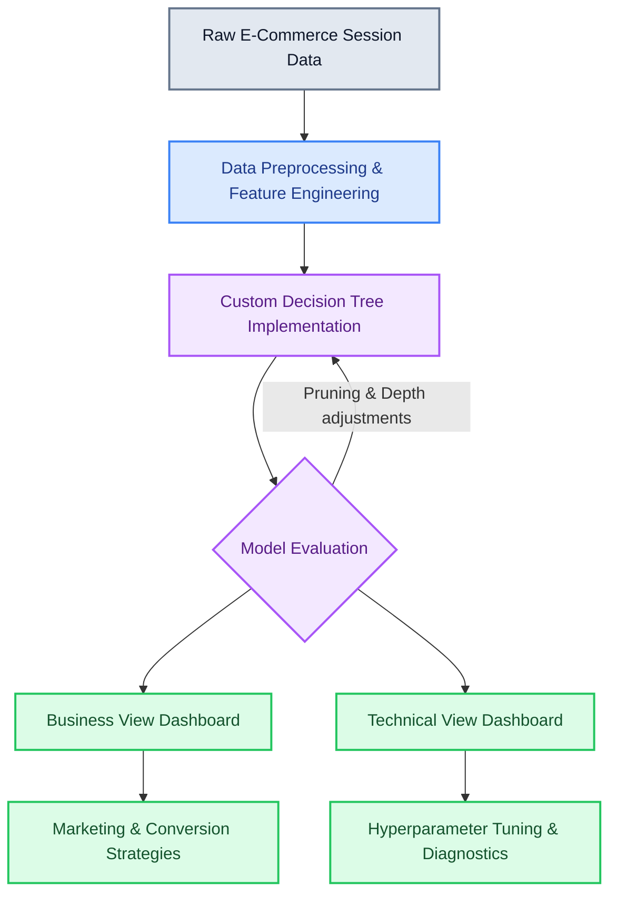
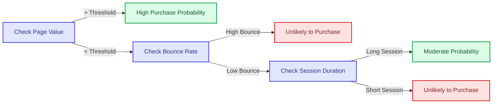

# PurchaseIQ: E-Commerce Purchase Prediction Dashboard

## 📖 Overview
PurchaseIQ is an intelligent web-based dashboard and predictive system built to forecast whether a user will complete a purchase on an e-commerce platform. Instead of relying on black-box AI, this project implements a **Decision Tree (CART)** algorithm *from scratch*, allowing for transparent, rule-based decision-making based on session-level behavioral data. 

This project bridges the gap between complex machine learning and actionable business insights. It serves two main audiences:
- **Business Owners & Marketing Teams:** To identify high-conversion users, understand which behaviors drive sales, and optimize marketing strategies.
- **Data Scientists & Analytics Teams:** To dive deep into model performance, threshold-based splitting, and pruning techniques designed to optimize predictive accuracy and prevent overfitting.

---

## 🏗️ Architecture & Pipeline

Here is a high-level view of how data flows from user sessions into actionable business insights:



---

## 📊 Dataset Description

The model evaluates behavioral data dynamically. In a real-world scenario, it mimics training on the **Online Shoppers Purchasing Intention Dataset**. Feature categories include:
- **Browsing Activity:** Pages visited (Administrative, Informational, Product Related) and time spent on those pages.
- **Engagement Metrics:** Bounce rates, exit rates, and page values specific to user sessions.
- **Contextual/Traffic Sources:** Visitor type (New vs. Returning), traffic source, operating system, browser, and weekend flags.

**Target Variable:** `Revenue` (Boolean: Yes/No) representing whether the session ultimately concluded with a purchase.

---

## 🤖 Decision Tree Implementation

Unlike using pre-built black-box libraries, this project showcases a **custom Decision Tree algorithm built from scratch**. By studying different tree depths, the system analyzes the trade-offs between overfitting and underfitting. 

### Key Technical Highlights:
- **Threshold-Based Splitting:** Efficiently processes continuous features (like session duration or page values) to find the most mathematically optimal split.
- **Explainable Decision Rules:** The model provides the explicit path that led to a purchase prediction ensuring high interpretability.
- **Feature Importance:** Automatically identifies and ranks the most influential factors driving user decision-making.
- **Pruning Techniques:** Incorporates logic to limit depth and apply simple pruning to generalize better to unseen visitors.



---

## 💻 Tech Stack & UI Features

The platform uses a modern, responsive web stack designed for both aesthetics and functionality:

- **Frontend Framework:** React 18, TypeScript, Vite
- **Styling:** Tailwind CSS, Lucide Icons, Custom UI Components
- **Routing:** React Router v7
- **Role-Based Access Control (RBAC):**
  - 💼 **Business View:** Clean, frictionless access. Hides deep metrics to strictly surface high-level KPIs, general predictions, and actionable recommendations.
  - 🔬 **Technical View:** Password-protected (`Q26SCvgYUZX20`) workspace exposing full model evaluations, Confusion Matrix, ROC insights, and Hyperparameter configurations.

---

## 🚀 Running the Code Locally

To run this dashboard on your own machine:

1. **Install Dependencies:**
   Ensure you have Node.js installed, then run:
   ```bash
   npm install
   ```

2. **Start the Development Server:**
   ```bash
   npm run dev
   ```

3. Open your browser and navigate to the local server URL provided in your terminal (usually `http://localhost:5173`).